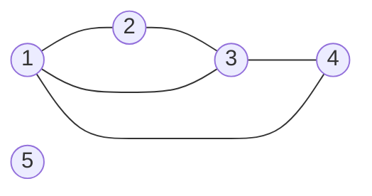
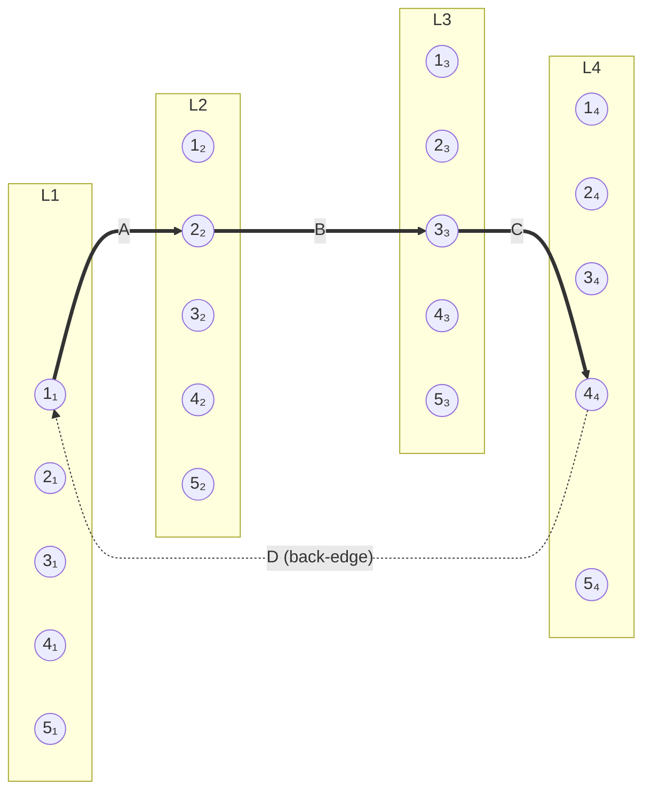

# How the Layered Graph is Formed — A Walkthrough for Speaker 4

> Your bridge between the original problem (Speakers 1–2) and the abstract 4-layered example you already know (the toy graph in `speaker-4-deep-dive.md` §2.1). Read this once, then re-read §2.1 — the symbols `L1, L2, L3, L4, A, B, C, D` should click into place.

## 0. The question this doc answers

Slides 8–10 (Speaker 3) introduce the **cyclic-join lens** and start talking about layers `L1, L2, L3, L4` and four biadjacency matrices `A, B, C, D` as if these were obvious. They are not. Where do they come from? What is the *original* graph? And how does counting 4-cycles in the original graph turn into counting **layered** 4-cycles in this 4-layered thing?

This doc unpacks the construction on a tiny concrete graph so the rest of the talk's vocabulary stops feeling like notation from nowhere.

---

## 1. The original graph

### 1.1 In general

The original graph is what Speaker 1 introduced on slide 2: a regular **undirected graph** `G = (V, E)` with `n` vertices and `m` edges. Think transactions between accounts, follows between users, citations between papers — any normal graph.

There are no layers, no roles, no biadjacency matrices yet. Just vertices and edges.

We want to count **4-cycles**: sets of four distinct vertices `{a, b, c, d}` such that all four edges `(a,b), (b,c), (c,d), (d,a)` exist in `G`. After every edge insertion or deletion to `G`, we must report the new exact count.

### 1.2 A concrete tiny example

Pick 4 vertices and 5 edges:

- `V = {1, 2, 3, 4, 5}`
- `E = {(1,2), (2,3), (3,4), (1,4), (1,3)}`



(Vertex 5 is isolated — included to remind you `V` can have non-participating vertices. The 4-cycle structure lives on `{1,2,3,4}`.)

**How many 4-cycles does this `G` contain?** Look for four distinct vertices that form a closed loop with all four edges present.

- `1 → 2 → 3 → 4 → 1`: edges `(1,2), (2,3), (3,4), (4,1)` — **all present**. ✓ One 4-cycle.

That's it. The extra diagonal `(1,3)` creates a triangle `1-2-3` and a triangle `1-3-4`, but no second 4-cycle. So `#C₄(G) = 1`.

**Now ask the dynamic question.** Insert the edge `(2, 5)`. Does the 4-cycle count change? No — vertex 5 doesn't sit on any 4-cycle yet. Now insert `(4, 5)`. Now `1 → 4 → 5 → 2 → 1`? Needs edge `(2,1)` ✓ and `(5,2)` ✓ and `(4,5)` ✓ and `(1,4)` ✓ — **yes, a new 4-cycle exists**. Count goes from 1 to 2.

That's the problem: maintain the count under every insertion/deletion, with a worst-case per-update guarantee.

---

## 2. Why we want a "layered" view

### 2.1 The four roles in a 4-cycle

Pick any 4-cycle `a → b → c → d → a`. Each vertex plays a specific **role** in the cycle:

- `a` is in **position 1**
- `b` is in **position 2**
- `c` is in **position 3**
- `d` is in **position 4**

The same vertex can play different roles in different 4-cycles. In the example above, vertex `1` is in position 1 of the cycle `1→2→3→4→1`, but it could equally well play position 3 of some other cycle.

### 2.2 The trick: give each role its own copy of the graph

Instead of letting vertex `1` "play many roles", give it **four labelled copies** — `1₁` (the copy in role 1), `1₂` (copy in role 2), `1₃` (copy in role 3), `1₄` (copy in role 4). Same for every other vertex.

Group all copies by their role:

- **Layer L1** = `{1₁, 2₁, 3₁, 4₁, 5₁}` — every vertex viewed as a "candidate for role 1"
- **Layer L2** = `{1₂, 2₂, 3₂, 4₂, 5₂}` — every vertex viewed as a "candidate for role 2"
- **Layer L3** = `{1₃, 2₃, 3₃, 4₃, 5₃}`
- **Layer L4** = `{1₄, 2₄, 3₄, 4₄, 5₄}`

Each layer is **a copy of the full vertex set `V`**. With `|V| = 5`, the lifted graph has `4 × 5 = 20` vertices total.

> **A layer is not a subset of `V`.** Don't confuse this with the H/M/L *degree* classes — those partition vertices *within* one layer based on degree. The layers themselves come from copying every vertex four times, once per cyclic role.

---

## 3. Lifting the edges into the four biadjacency matrices

### 3.1 The rule

For every edge `(u, v) ∈ E` in the original `G`, put a `1` in **all four** biadjacency matrices, in both directions:

| Matrix | What it connects | Entries from edge `(u,v)` |
|---|---|---|
| `A` | L1 → L2 | `A[u, v] = 1` and `A[v, u] = 1` |
| `B` | L2 → L3 | `B[u, v] = 1` and `B[v, u] = 1` |
| `C` | L3 → L4 | `C[u, v] = 1` and `C[v, u] = 1` |
| `D` | L4 → L1 | `D[u, v] = 1` and `D[v, u] = 1` |

Each matrix is `|V| × |V|` (here `5 × 5`), with rows indexed by the source layer and columns by the destination layer. Reading `A[u, v] = 1` aloud: *"in the lifted graph, there is an edge between the L1-copy of `u` and the L2-copy of `v`."*

The construction is dead simple: **every edge of `G` gets replicated 8 times in `G'`** (4 matrices × 2 directions). That's the constant-factor blow-up the theory notes mention.

### 3.2 The example, written out

Our `G` has edges `{(1,2), (2,3), (3,4), (1,4), (1,3)}`. Each matrix `A, B, C, D` is then the same `5 × 5` symmetric 0/1 table:

```
        col: 1  2  3  4  5
row 1     [  0  1  1  1  0 ]
row 2     [  1  0  1  0  0 ]
row 3     [  1  1  0  1  0 ]
row 4     [  1  0  1  0  0 ]
row 5     [  0  0  0  0  0 ]
```

So `A = B = C = D` for now (because we just dumped the edges of `G` into all four matrices identically).

### 3.3 Picture of the lifted graph

The lifted graph `G'` is a 4-layered graph. Edges only run between consecutive layers (and `L4 → L1` closes the cycle via `D`). Drawing all the edges at once is unreadable — every matrix has 10 entries (5 undirected `G`-edges × 2 directions), and the `D` back-edges visually scramble the layout. So instead of drawing the whole lifted graph, we draw **one specific layered 4-cycle** — the one that comes from lifting the original 4-cycle `1 → 2 → 3 → 4 → 1` in `G`:



Reading this: the single layered 4-cycle `1₁ → 2₂ → 3₃ → 4₄ → 1₁` uses one entry of each matrix — `A[1,2]`, `B[2,3]`, `C[3,4]`, `D[4,1]`. All four of those entries are `1` (they came from the original edges `(1,2), (2,3), (3,4), (1,4)`), so this is a valid layered 4-cycle. It is the lifted image of the original cycle `1 → 2 → 3 → 4 → 1` in `G`.

**Important caveats about this picture:**

- It shows **one** layered 4-cycle. The actual `G'` has many more edges — every matrix `A, B, C, D` contains all 10 of `G`'s directed edge endpoints, and there are also edges like `A[1,3]`, `A[1,4]`, `A[2,1]`, etc. The picture omits them all to keep the layout clean.
- Vertex 5's copies are present in every layer but have no incident edges (since 5 is isolated in `G`).
- The same original 4-cycle `1-2-3-4-1` produces **other** layered 4-cycles too: `1₁ → 4₂ → 3₃ → 2₄ → 1₁` (the reverse traversal), `2₁ → 3₂ → 4₃ → 1₄ → 2₁` (rotation), etc. There are 8 in total — that's the constant factor in §4.4.

---

## 4. Layered 4-cycles, and the bijection

### 4.1 What a layered 4-cycle is

A **layered 4-cycle** in `G'` is a closed walk `α → β → γ → δ → α` such that:

- `α ∈ L1`, `β ∈ L2`, `γ ∈ L3`, `δ ∈ L4` (one vertex per layer, in order)
- `A[α, β] = 1`, `B[β, γ] = 1`, `C[γ, δ] = 1`, `D[δ, α] = 1`

In words: pick one candidate per role, then check that consecutive pairs are connected by the appropriate matrix.

### 4.2 Counting them = trace of the matrix product

The total number of such layered 4-cycles is exactly

```
#layered_C₄ = trace(A · B · C · D)
```

This is the **bulk computation** Speaker 2 talked about on slide 7 — and it is the source of the FMM speedup, because evaluating `A · B · C · D` is just three matrix products. Speaker 3's slide 8 is showing this exact picture.

### 4.3 Worked count on the example

Let's verify on our tiny graph. The trace counts the diagonal of `M = A · B · C · D`. Each entry `M[v, v]` is the number of closed 4-walks `v₁ → ? → ? → ? → v₁` using each layer once.

Without grinding out the matrix product by hand, observe what the trace counts directly:

- Pick `α = 1₁` (vertex 1 in role 1). How many layered 4-cycles return to `1₁`?
  - Walk `1₁ → β → γ → δ → 1₁` with `β ∈ N(1) = {2, 3, 4}`, `δ ∈ N(1) = {2, 3, 4}`, and `(β, γ), (γ, δ)` edges in `G`.
  - Enumerate `(β, δ)` pairs and count midpoints `γ` adjacent to both:
    - `β=2, δ=2`: midpoints adjacent to 2 = `{1, 3}`, common = `{1, 3}` → 2 walks (but `γ=1` means `1₃` visits vertex 1 again — allowed in a *walk*, forbidden in a *cycle*; see §4.4)
    - `β=2, δ=3`: common neighbours `{1}` → 1
    - …etc.

The raw walk count includes degenerate walks that re-use vertices (so they aren't proper 4-cycles in `G`). The **update protocol** (next section) is what removes these.

### 4.4 The bijection (proper 4-cycles only)

Once you correctly exclude walks that revisit a vertex, every layered 4-cycle in `G'` corresponds to a **4-cycle in `G`**, modulo a constant factor for **rotations and reflections**. A 4-cycle on vertex set `{a,b,c,d}` in `G` admits 8 distinct labellings as `α→β→γ→δ→α` (4 rotations × 2 directions), so

```
#layered_C₄(G')  =  8 · #C₄(G)        (up to degenerate walks)
```

For our example, `#C₄(G) = 1`, so there are 8 layered 4-cycles in `G'`, all derived from the single 4-cycle `1→2→3→4→1`.

The constant 8 is irrelevant to the algorithmic problem — we maintain `trace(A·B·C·D)` and divide by 8 at the end.

---

## 5. The update protocol — why walks become cycles

### 5.1 The trick

When an edge `(u, v)` is inserted into the original `G`, we don't just write it into `A, B, C, D` simultaneously. Order matters:

- **Insertion:** insert into `D` first, then `C`, then `B`, then `A`.
- **Query:** read off the count **immediately after the `D`-update, before any subsequent A/B/C updates**.
- **Deletion:** reverse order — delete from `A`, then `B`, then `C`, then `D`.

### 5.2 Why this matters

At query time, the freshly inserted edge `(u, v)` is **present in `D`** but **absent from `A, B, C`**. So any layered 4-cycle counted by the matrix product that uses this new edge must use it specifically as a `D`-edge — i.e. `δ → α` where `δ` is the L4-copy of `u` (or `v`) and `α` is the L1-copy of `v` (or `u`).

Because the edge is missing from `A, B, C`, the cycle's other three steps can't sneak in another visit to `u` or `v`. This forces every counted layered 4-cycle to be a **proper 4-cycle in `G`** — four distinct vertices — and rules out the degenerate walks that revisit a vertex.

So the protocol is what makes "trace of the product" actually count what we want, on the new edge.

---

## 6. Connecting to the toy example in `speaker-4-deep-dive.md`

The deep-dive's worked example (its §2.1) **starts already in 4-layered form**:

- `L1 = {a, b, c}` — these are *not* vertices of an original `G`. They are the **L1-copies** of three vertices in some imagined original graph, where vertex `a` has high degree (it's a hub).
- `L2 = {p, q}`, `L3 = {r, s}` — same: copies in roles 2 and 3.
- `L4 = {x, y, z}` — copies in role 4. Vertex `x` is a hub.
- `A, B, C` are the biadjacency matrices the lifting produced. `D` is initially empty — that's where the update stream lands.

The deep-dive then asks: **what happens algorithmically when a new D-edge `(x, a)` arrives**, given the precomputed products `AB_H`, `ABC_HH`?

**Where do `a` and `x` being "hubs" come from?** They are H-class because their *degree in the original `G`* (which translates to row/column sums in `A, B, C`) is large. The H/M/L partition is *per layer*, applied to the layer-copies. It is a **second** partitioning, on top of the lifting:

1. **First** (the lifting, this document): every vertex becomes 4 copies, one per role; edges fan out into 4 matrices.
2. **Second** (degree classes, the algorithm proper): within each layer, copies are sorted by degree into High / Medium / Low classes. This is what determines which precomputed table is consulted on each update.

So your speech, end-to-end:

> "The original graph is general — vertices, edges, evolving. To count 4-cycles we lift each vertex into four role-copies, producing a 4-layered graph with biadjacency matrices `A, B, C, D`. Within each layer, the algorithm further sorts vertices by degree into High, Medium, Low classes, and precomputes products restricted to those classes. When an update arrives on `D`, the algorithm reads off `ABC[i, l]` from whichever precomputed table matches the classes of `i` and `l`."

That's the whole pipeline, in one paragraph.

---

## 7. One-line summary for Q&A

If someone asks *"what is the original graph?"*: it's a normal undirected graph. The 4 layers are **bookkeeping** — each layer is a copy of all vertices, viewed as candidates for one of the four cyclic roles in a 4-cycle. The four matrices `A, B, C, D` are how the edges fan out, and `trace(A·B·C·D)` counts 4-cycles up to a constant factor. The algorithm's H/M/L degree classes are a *further* partition within each layer, and the precomputed `ABC_HH`-style tables are what make the per-update work `O(1)` in the bilateral-hub regime.
