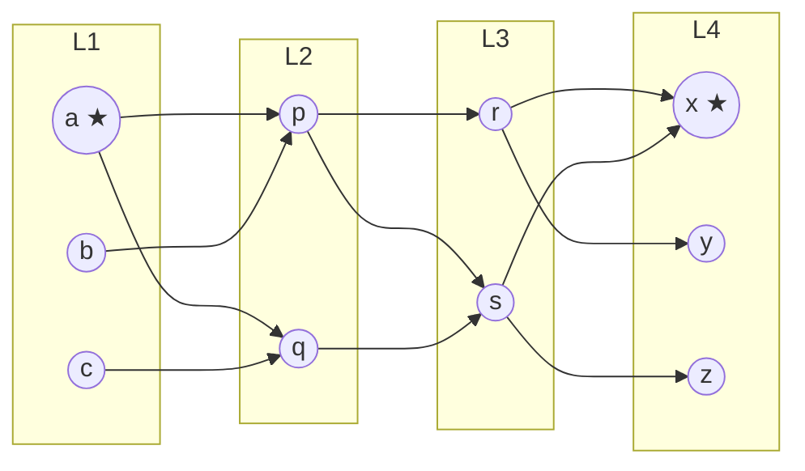
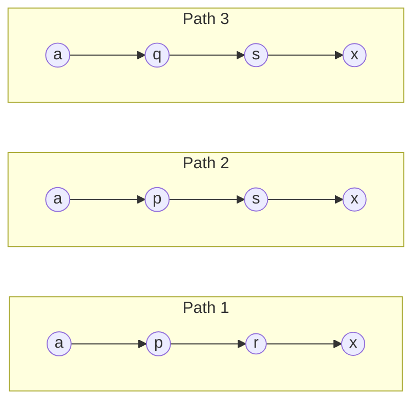
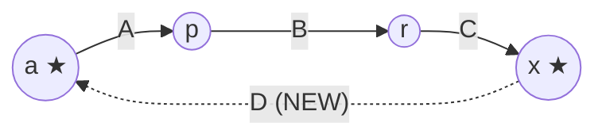

# Speaker 4 — Deep Dive: Experiments and Takeaway

> Your private prep doc. Read this before the dry run, re-read the day of the talk. By the end you should be able to defend every line of slides 11–13 against a skeptical audience.

## 0. Your job in one sentence

Speaker 3 makes an **algebraic** claim: of the five inequalities in the constraint system, the FMM one is the load-bearing one. **Your job is to land the empirical counterpart of that same claim**: of the four input regimes we tested, only the bilateral-hub regime makes the surrounding machinery actually pay. Same conclusion, two angles. That symmetry IS the talk — close that loop and you've done your job.

---

## 1. What you present at a glance

You own slides **11, 12, 13** and the closing **slide 14 (thanks)**. Total target ~3:35.

| Slide | Title | Time | What the audience must take away |
|---|---|---|---|
| 11 | Implementation and empirical setup | ~1:00 | We built it honestly. Algorithm + baseline + harness, same inputs and updates. We are testing **shape of the win**, not asymptotics. |
| 12 | Where the algorithm wins | ~1:30 | Bilateral high-degree structure → new algorithm wins (slope 0.31). Otherwise → baseline ties. The algorithm targets one structural regime. |
| 13 | Takeaway | ~1:00 | Theory says one step is load-bearing. Empirics say one regime fires. They are the same statement in two languages. Plus three open directions. |
| 14 | Thanks | ~5 s | Stop talking. Wait for hands. |

---

## 2. What "the algorithm" actually is in our experiment

This is the **single most common source of confusion** in Q&A. The thing we benchmark is **not the full Assadi–Shah algorithm**. It is a faithful-in-shape implementation called **Warmup_v3**, corresponding to **§3 of the paper** (the warm-up section), with explicit honest simplifications. You MUST be able to state them all when challenged.

### 2.1 A tiny worked example — anchor every symbol

Before any matrix notation: a concrete tiny graph. Numbers small enough to do in your head. **Re-read this whenever a symbol below looks abstract.**

**Setup.** Take `n_per_layer = 3` (3 vertices per layer, 12 total). One hub per side of the D-cycle, low-degree elsewhere:

- **L1**: vertices `a, b, c`. `a` is a **hub** (degree 2 to L2). `b, c` are low (degree 1).
- **L2**: vertices `p, q`. (Small layer — everyone is low.)
- **L3**: vertices `r, s`. (Small layer — everyone is low.)
- **L4**: vertices `x, y, z`. `x` is a **hub** (degree 2 to L3). `y, z` are low.

**Class assignment** (the H/M/L thing — these are the degree-class labels Warmup_v3 routes by). With a threshold somewhere between 1 and 2:
- L1: **`a` is H** (High class). `b, c` are L (Low). M (Medium) is empty.
- L4: **`x` is H**. `y, z` are L. M is empty.

In the real experiment, with `k_hubs = 5`, the 5 hub vertices per side are the H class, everything else is L.

**The biadjacency matrices.** Each is a 0/1 table whose rows are vertices of one layer and columns are the next layer.

```
       L2: p q                  L3: r s                  L4: x y z
L1: a [ 1 1 ]            L2: p [ 1 1 ]            L3: r [ 1 1 0 ]
    b [ 1 0 ]                q [ 0 1 ]                s [ 1 0 1 ]
    c [ 0 1 ]
        A (L1×L2)                B (L2×L3)                C (L3×L4)
```

Reading: `A[a, p] = 1` means "there is an edge between `a ∈ L1` and `p ∈ L2`". `B[p, r] = 1` means "edge `p ∈ L2`, `r ∈ L3`". Etc. `D` (L4×L1) is where updates arrive — start empty.

**Same graph as a picture.** Hubs `a` and `x` are starred; arrows show the cycle traversal direction L1 → L2 → L3 → L4 (→ L1 via D, which is currently empty).



Notice that `a` has 2 outgoing A-edges (`p`, `q`) — it's the only hub in L1. Similarly `x` has 2 incoming C-edges (from `r`, `s`) — the only hub in L4.

**Decoding the funny superscripts.**

- `A^{H*}` = **rows of `A` indexed by H-class vertices in L1**. Only `a` is H, so it's the `a` row:
  ```
  A^{H*}  =  [ 1  1 ]      ← (1 × |L2| matrix)
  ```
- `C^{*H}` = **columns of `C` indexed by H-class vertices in L4**. Only `x` is H, so it's the `x` column:
  ```
  C^{*H} =  r [ 1 ]        ← (|L3| × 1 matrix)
            s [ 1 ]
  ```
- The asterisk `*` is a wildcard — "all rows" or "all columns". So `A^{H*}` = "H rows, all columns of A". `C^{*H}` = "all rows, H columns of C".

**Now the product `A^{H*} · B`** — this is **"count 2-hop paths from H-class L1 vertices to L3"**:

```
A^{H*} · B  =  [1 1] · [[1 1], [0 1]]  =  [1·1+1·0,  1·1+1·1]  =  [1  2]
                                                ↑          ↑
                                          paths a→r    paths a→s
```

Sanity-check by enumeration:
- 2-hop paths `a → ? → r`: via `p` works (`A[a,p]·B[p,r] = 1·1`), via `q` doesn't (`B[q,r]=0`). **Total: 1.** ✓
- 2-hop paths `a → ? → s`: via `p` works (`B[p,s]=1`), via `q` works (`B[q,s]=1`). **Total: 2.** ✓

This row vector `[1, 2]` is **exactly what `AB_H` stores in Warmup_v3** (paper Eq 1). It's recomputed only when A or B changes. In our experiment A is frozen and only B updates, so `AB_H` is cheap to maintain.

**Now `ABC_HH = A^{H*} · B · C^{*H}`** — the H×H 3-hop count from L1 to L4:

```
ABC_HH = [1  2] · [[1], [1]]  =  [1·1 + 2·1]  =  [3]
                                       ↑
                                  count a→x
```

So `ABC_HH[a, x] = 3`. There are exactly **3 length-3 paths from `a` to `x`**. Enumerate:
1. `a → p → r → x`  (A[a,p]·B[p,r]·C[r,x] = 1·1·1) ✓
2. `a → p → s → x`  (1·1·1) ✓
3. `a → q → s → x`  (1·1·1) ✓
(`a → q → r → x` fails: B[q,r] = 0.)

The three paths, side by side:



The number `3` is what `ABC_HH[a, x]` directly stores, ready to read in O(1).

**Why this is the whole point.** Now insert a new D-edge `(x, a)` (i.e., `D[x, a] = 1`).

**Number of new 4-cycles = `ABC_HH[a, x] = 3`.** Why? Each of the 3 length-3 paths `a → · → · → x` is closed into a 4-cycle by the new edge `x → a`. **Δ is a single table lookup. O(1) work, regardless of how many edges `a` and `x` have.**

Visually, one of the three new 4-cycles (the others differ only in the middle two vertices):



Three 4-cycles total, each closed by the same new D-edge `(x, a)`.

Compare to the baseline (Layered Simple Wedge). It would compute:
```
Δ = Σ_{w ∈ N_C(x)} W_13[a, w]
  = W_13[a, r] + W_13[a, s]
  = 1 + 2  =  3
```
where `N_C(x) = {r, s}` is the L3-neighbours of `x`. **Cost: `O(deg_C(x))`** = 2 lookups here.

Tiny gap in our toy graph (1 vs. 2). **But scale it up**: if `x` were a real hub connected to 1000 L3 vertices, the baseline does 1000 lookups per update; Warmup_v3 still does **1**. That's the algorithmic asymmetry slide 12's plot measures.

**Contrast: what if the D-update lands in the LL cell?** Insert `(z, b)` instead (`z ∈ L4` is L, `b ∈ L1` is L). The HH table doesn't help — neither endpoint is in H. The algorithm falls to the **LL** branch of its dispatch:
```
Δ = brute over N_A(b) × N_C(z) = {p} × {s}
  = check path b → p → s → z:  A[b,p]·B[p,s]·C[s,z] = 1·1·1  ✓
  = 1
```
**Cost: `O(deg_A(b) · deg_C(z))`** — but both `b` and `z` are low-degree by construction, so this is also cheap. **Same asymptotic cost as the baseline.** Warmup_v3 wins nothing on this update.

**Take-away from the example.** In the **bilateral hub regime**, `hub_bias = 0.85` deliberately concentrates updates on D-edges `(hub L4, hub L1)` — the **HH cell**. Warmup_v3 hits the O(1) lookup most of the time. The baseline pays O(hub-degree) every time. That's the slope-0.31-vs-0.89 gap on the plot. Same algorithm in the unilateral / no-hub / ER regimes lands mostly in LL/HL/LH cells where neither approach has a structural advantage — **so the baseline ties or wins on bookkeeping**.

Keep this example in mind whenever you read `A^{H*} · B`, `ABC_HH`, `deg_C(l)`, or "the dispatch table" in the rest of this doc.

---

### 2.2 What Warmup_v3 actually maintains

Concretely (from `code/algorithms/warmup_v3.py`), the algorithm maintains six precomputed matrix products restricted to the **High (H)** and **Medium (M)** vertex classes:

- `AB_H = A^{H*} · B` — paper Eq (1)
- `AB_M = A^{M*} · B` — paper Eq (3)
- `BC_H = B · C^{*H}` — paper Eq (1)
- `BC_M = B · C^{*M}` — paper Eq (3)
- `ABC_HH = A^{H*} · B · C^{*H}` — paper Eq (1)
- `ABC_HM, ABC_MH, ABC_MM` — paper Eq (3) cross-products

The point: when a D-update arrives between vertices `(l ∈ L4, i ∈ L1)`, the increment to the 4-cycle count is `Δ = ABC[i, l]`. Where `ABC[i, l]` is **looked up** depends on the **classes** of `i` and `l`:

| class(i) | class(l) | Cost of Δ lookup |
|---|---|---|
| H | H | **O(1)** — direct table lookup in `ABC_HH` |
| H | M, M | H | O(1) via the relevant cross-product |
| M | M | O(1) |
| H | L | iterate N_C(l) — O(deg_C(l)) but l is low-deg so cheap |
| L | H | iterate N_A(i) — symmetric |
| L | L | brute over N_A(i) × N_C(l) — but both low-deg |

**This is the whole class-routing mechanism in one table.** When `i` and `l` are BOTH hubs (the HH cell), the algorithm pays O(1). The baseline, in the same situation, has no such cached table and walks O(deg) work.

### 2.3 Restrictions of Warmup_v3 vs. the full paper algorithm

You should be ready to name these out loud:

1. **A and C are frozen.** Only `B` and `D` get updates. (Paper §3 Assumption 3.) The full algorithm allows all four matrices to update; that requires §7 (mid-stream class changes), which we don't implement.
2. **No phases.** The full algorithm batches updates into phases of `m^{1-δ}` and pre-computes the next phase's product in the background. We don't. (Paper §5 not implemented.)
3. **Chunk size = 1.** No batched B-flushes; the Eq (4) DD/SD/DS structures collapse to brute enumeration.
4. **Class thresholds fixed at construction.** An update that would push a vertex across a threshold raises `ClassStabilityError`. The full algorithm handles these dynamically (paper §7).
5. **NumPy GEMM substitutes for FMM.** GEMM is cubic, `O(n^3)`. The asymptotics in our code are therefore **strictly worse** than the paper's `O(m^{2/3-ε})`. This is the crucial caveat.

### 2.4 The crucial honest claim — say it out loud on slide 11

> **"At the scales we test, the win over the baseline comes from class-based work avoidance, not from FMM itself."**

We are not pretending NumPy GEMM is FMM. We are testing whether the **structural decisions** of the algorithm — class partitioning, precomputed products, routing per-update work by class — produce a measurable win. They do, in the bilateral regime. **That tests the framework, not the FMM exponent.**

This is honest, defensible, and the right framing. Memorize it.

---

## 3. What "the baseline" actually is

The fair baseline is **Layered Simple Wedge** (`code/algorithms/layered_simple_wedge.py`). It is the **same wedge-counting idea** as paper Appendix A, but specialized to a 4-layered graph and counting exactly the same thing as Warmup_v3 — `trace(A · B · C · D)`, i.e. layered 4-cycles.

### 3.1 What it maintains

One matrix:

> `W_13[i, w] = number of 2-hop paths from i ∈ L1 to w ∈ L3 through L2 = Σ_j A[i, j] · B[j, w]`

That's it. One wedge matrix, no class structure, no precomputed triple products.

### 3.2 Per-update Δ

| Update layer | Δ computation | Asymptotic cost |
|---|---|---|
| D-update `(l ∈ L4, i ∈ L1)` | `Σ_{w ∈ N_C(l)} W_13[i, w]` | O(deg_C(l)) |
| C-update `(w, l)` | `Σ_{i ∈ N_D(l)} W_13[i, w]` | O(deg_D(l)) |
| B-update `(j, w)` | brute over `N_A(j) × N_C(w)` | O(deg_A(j) · deg_C(w)) |
| A-update `(i, j)` | brute over `N_B(j) × N_D(i)` | O(deg_B(j) · deg_D(i)) |

### 3.3 Why this matters in the bilateral experiment

In our experiment, the **stream is D-only and hub-biased**. So the dominant per-update cost is **O(deg_C(l))** where `l` is the L4 endpoint of the D-edge.

When `l` is a hub in L4, `deg_C(l) ≈ n_per_layer` (a hub has connections to many vertices in L3). So **the baseline pays O(n) per update** every time a hub in L4 is touched.

Warmup_v3 pays **O(1) for that exact case** because `(i, l)` are both H-class — and the `ABC_HH` table holds the answer directly. **That O(1) vs. O(n) gap is exactly what the slope 0.31 vs. 0.89 in the plot shows.**

---

## 4. The bilateral-hub experiment — every parameter, decoded

The experiment is **Experiment 3.6.2** in `code/bench/runner.py` (line 597+). Here are the exact knobs:

| Parameter | Value | What it means |
|---|---|---|
| `n_per_layer` | 200, 500, 1000, 2000 | Vertices per layer. The x-axis of the plot. |
| `k_hubs` (L1) | 5 | Number of hubs in layer L1 |
| `k_hubs_l4` | 5 | Number of hubs in layer L4 — **THIS is what makes it bilateral** |
| `low_deg` | 5 | Non-hub vertices have ~5 neighbours each |
| `hub_density` | 0.5 | Each hub connects to ~50% of the next layer |
| `hub_bias` | 0.85 | **85% of stream operations are biased to touch a hub** |
| `n_ops` | 200 | Number of update operations per run |
| `n_seeds` | 3 | We take the median over 3 random seeds |
| Stream | D-only | All updates are insertions/deletions in the D matrix |
| Quantity reported | median µs per update | Standard performance metric |

### 4.1 What "bilateral" means precisely

**Bilateral** = hubs on **both** sides of the D layer connection (L1 AND L4).

Recall the layer graph: `L1 ↔ A ↔ L2 ↔ B ↔ L3 ↔ C ↔ L4 ↔ D ↔ L1`. The D matrix connects L4 back to L1.

- **No hubs**: low_deg = 5 everywhere, no concentrated structure.
- **Unilateral hubs**: k_hubs > 0 on one side only (say L1), other side uniform low.
- **Bilateral hubs**: k_hubs > 0 on **both** L1 and L4. Now a D-edge `(l ∈ L4, i ∈ L1)` has **a non-trivial probability of both endpoints being hubs**, especially with hub_bias = 0.85.

The bilateral case is what makes the HH-cell of the dispatch table — the O(1) lookup — actually fire on a large fraction of updates. The other regimes don't trigger the HH lookup often enough for the precomputed `ABC_HH` table to pay for itself.

### 4.2 Why hub_bias = 0.85 and not 0.99 or 0.5?

It's a controlled stress. At hub_bias = 1.0 every update is hub-to-hub and the algorithm trivially wins. At hub_bias = 0.0 the bilateral structure is invisible to the update stream. 0.85 is a realistic-leaning regime: most "interesting" updates concentrate where there's structure, but not all.

### 4.3 Why D-only updates?

Two reasons:
1. **Warmup_v3 only supports B and D updates** by construction (Assumption 3, see §2.2).
2. D-updates are the ones where the `ABC` lookup directly answers the count. Restricting to D isolates the effect of the HH lookup.

This is honest scope. The Q&A answer is: "We test the regime where the algorithm's main optimization fires. The full algorithm handles A and C updates too — that's §7 of the paper, not implemented."

---

## 5. Reading the plot — line by line

The plot on slide 12 is `figures/fig8c_bilateral.pdf`. It is a **log-log plot**.

- **X-axis**: `n_per_layer` (200 → 2000)
- **Y-axis**: median µs per update (log scale, 1 → 1000)

Three curves, from top (slowest) to bottom (fastest):

| Curve | Colour | Slope | At n_per=2000 |
|---|---|---|---|
| **Simple Wedge (general 4-cycles)** — the unfair baseline that doesn't know about layers | blue | **0.94** (near-linear) | ~500 µs |
| **Layered Simple Wedge (fair baseline)** — same idea, knows it's running on a 4-layered graph | green | **0.89** | ~35 µs |
| **Warmup_v3 (paper §3)** — the new algorithm | red | **0.31** | ~7 µs |

### 5.1 What the slopes mean

A slope of `s` on a log-log plot means cost grows as `n^s`. So:

- Simple Wedge `s ≈ 0.94`: cost grows ~linearly in `n_per_layer`. Hub-touching updates cost ~`n`.
- Layered Simple Wedge `s ≈ 0.89`: same story, slightly better constants because it's layered-aware.
- Warmup_v3 `s ≈ 0.31`: **sub-linear growth** — closer to `n^{1/3}`. The HH-cell lookup is O(1); the only growth comes from non-HH updates which are 15% of the stream.

**The slope gap is the asymptotic argument.** Constants are nice; slopes are the real story.

### 5.2 What to point at in the talk

When you say *"the new algorithm grows much more slowly than the baseline,"* point at the RED line. When you say *"the gap opens as the input grows,"* trace the gap between RED and GREEN with your finger from left to right. Don't try to walk the blue line — it's the strawman comparison, mention it once if at all.

### 5.3 Numerical anchor in case someone asks

At n_per_layer = 2000, Warmup_v3 is **5× faster than the fair baseline** and **~70× faster than the general baseline**. The 5× number is the conservative defensible one.

---

## 6. The other three regimes (mentioned, not plotted on slide 12)

On slide 12 the diagram on the right shows three small cycles: bilateral (✓), unilateral, no hubs. Slide 12's plot ONLY shows the bilateral regime — that's deliberate, it's the regime where there's something interesting to see. The other two regimes are summarized in one sentence on the slide and discussed here for Q&A.

### 6.1 Unilateral hubs (hubs on one side only)

Hubs in L1, low-deg uniform in L4 (or vice versa). The D-edges from hub-L1 vertices have low-deg L4 endpoints — so `(i, l)` is at best (H, L). That cell in the dispatch table is **not O(1)** — it iterates `N_C(l)`. Since `l` is low-deg, that's cheap, but it's the same cost as the baseline doing the wedge sum. **No advantage.**

### 6.2 No hubs (uniform low-deg)

No H-class vertices exist at all. The `ABC_HH` table is empty. Every D-update lands in the LL cell — brute enumeration. Warmup_v3 still maintains all the bookkeeping but it doesn't pay off. **Baseline matches.**

### 6.3 Erdős–Rényi (random)

Like "no hubs" but with random edges instead of structured low-deg. Same conclusion. **Baseline matches.**

### 6.4 The point you make

> "The algorithm is not a generic accelerant. It targets a specific structural regime — bilateral hubs — where the precomputed HH product carries actual work. On other inputs, the routing overhead doesn't pay off."

That's the whole empirical message. Don't say more.

---

## 7. The two-angles framing — close the loop

Slide 13 is where you tie the talk together. There are two parallel statements:

| Algebraic (Speaker 3) | Empirical (you) |
|---|---|
| Of 5 inequalities in the constraint system, **only one binds** at the conjectural optimum | Of 4 input regimes we tested, **only one regime triggers a win** |
| The binding inequality is the **FMM rectangular product** | The triggering regime is **bilateral hubs** (the HH-cell) |
| **Remove FMM → bound collapses to `m^{2/3}`** | **Remove bilateral structure → baseline matches** |

Both say: *"The surrounding machinery exists to feed one well-conditioned FMM step."* From two completely different angles — one algebraic, one experimental — you converge on the same load-bearing structure.

**This is the talk's payoff.** Land it cleanly. Don't rush it. Pause after "they say the same thing."

---

## 8. The three open directions — defended

Slide 13 lists three. Be ready to defend each one.

### 8.1 "Larger cycles — k-cycles beyond 4"

The cyclic-join lens generalizes mechanically: a `k`-cycle is a cyclic conjunctive query of arity `k`. The matrix-multiplication step generalizes to multiplying `k/2` matrices for even `k`. Open question: does the load-bearing FMM structure survive? Probably yes for even `k`, less clear for odd `k`.

### 8.2 "Online detection of the bilateral regime, with fallback"

Right now the algorithm is run blindly. In practice you'd want a meta-algorithm that watches the update stream, detects whether bilateral structure is emerging, and routes to Warmup_v3 if yes, baseline if no. This is engineering, not theory, but it's the natural practical step.

### 8.3 "Closed-form analysis at current MM exponents"

Our `ε = 1/24` is at the **conjectural** `ω = 2`. At current best `ω < 2.371339`, the constraint system has different binding values. Closed-form solutions there would be a nice algebraic refinement (and would tell you the actual `ε` you'd get with real FMM today, instead of the limit).

---

## 9. Q&A — questions you must be able to answer cold

These are the questions most likely to come at you. Memorize the spine of each answer.

### 9.1 "Your code uses NumPy GEMM, not real FMM. Doesn't that invalidate the result?"

**Short:** No, because we're not claiming an asymptotic improvement.
**Long:** Production FMM implementations don't exist below Strassen (`ω ≈ 2.81`), and NumPy uses cubic GEMM. We aren't testing FMM asymptotics — we're testing **structural decisions about input partitioning and class routing**. At the scales we test (n up to 2000), the slope gap between 0.31 and 0.89 comes from class-based work avoidance, not the inner multiply. The framework's structural value is what we measured. If/when real FMM becomes practical, the bound improves further — but that's not what this experiment tested.

### 9.2 "How big are these graphs really?"

n_per_layer up to 2000, so total m on the order of 10^4–10^5 edges. Modest. Limited by NumPy GEMM being cubic — beyond ~10^4 per layer, build time blows up. The structural finding is robust within the tested range; whether it persists at much larger scales is open.

### 9.3 "How often do bilateral hubs occur in real data?"

We didn't sample real workloads. It's an open direction (slide 13). Anecdotally: in fraud detection a known scammer cluster often forms a bilateral hub (many in-going, many out-going from a small set of accounts). In recommendation cycles, popular content can appear at both ends of common paths. Plausibly real, but unmeasured.

### 9.4 "Is your A and C being frozen a fatal restriction?"

It's the §3 warm-up restriction. The full §4–§7 algorithm relaxes it. We frozen A and C to isolate the effect of the HH lookup — the part of the algorithm that does the work in our regime. The full algorithm handles all four matrix updates but requires phases (§5) and dynamic class changes (§7), which we don't implement.

### 9.5 "What's the practical takeaway today?"

Two things:
1. **For databases:** if your cyclic-join workload has bilateral structural hubs, class-routing pays off — even with cubic matmul, even without real FMM. That's a usable engineering signal.
2. **For theory:** the empirical bilateral-wins finding is structurally aligned with the algebraic FMM-binds-the-bound finding. That alignment is the contribution beyond the paper.

### 9.6 "Why is the simple wedge baseline so much worse than the layered version?"

The general Simple Wedge counts 4-cycles in an arbitrary graph and maintains a wedge matrix over all `(u, v)` pairs. The Layered Simple Wedge restricts to the 4-layered structure and only maintains `W_13` between L1 and L3. The latter does strictly less work; it's the fair baseline. The general one is included to show that *even the natural simpler counter without layer awareness* is dominated, but most of that gap is bookkeeping efficiency, not the structural insight. Don't dwell on the general one.

### 9.7 "How did you pick `hub_bias = 0.85`?"

It's a controlled stress test, deliberately not 1.0 (trivial) or 0.5 (washes out the regime). 0.85 is the sweet spot where the bilateral structure is present and most-but-not-all updates trigger HH lookups. If we'd swept hub_bias, we'd see a smooth transition; we picked a representative point.

### 9.8 "What's the gap to the lower bound?"

The OMv-conditional lower bound is `Ω(m^{1/2-γ})`. The Assadi–Shah upper bound is `O(m^{2/3-ε})` with our `ε = 1/24` at the conjectural `ω = 2`. Big gap between `m^{1/2}` and `m^{0.625}`. Nobody knows where the truth is.

### 9.9 "Could real FMM make this practical?"

Not directly. Theoretical FMM beats Strassen only asymptotically — for matrix sizes way bigger than fit in memory. Practical 4-cycle counting today doesn't get help from FMM. The contribution of the paper is **theoretical**: it tells you the right shape for an asymptotically-faster algorithm. Our experiment shows the structural shape works even with cubic matmul, in the bilateral regime.

### 9.10 "Why did the simple wedge slope come out 0.94, not 1.0?"

Wedge counting on a hub-heavy graph has cost roughly proportional to the touched hub's degree. With low_deg = 5 and hub_density = 0.5, hub degree is ~`n_per_layer / 2`. Linear in n, so slope ≈ 1.0. The 0.94 vs 1.0 discrepancy is finite-size effects + constant overheads at small n. Don't read deep meaning into the 0.06.

---

## 10. Cross-section Q&A backup — questions for OTHER speakers but might come to you

Questions during Q&A can land on anyone. Here's the minimum you must know about the rest of the talk to give a usable answer or redirect.

### 10.1 "What is `m^{2/3}` and where does it come from?" (Speaker 2's slide 5)

It's the natural balance from splitting vertices at degree threshold `m^{1/3}`. Cheap answer: *"degree-class balance at threshold `m^{1/3}` — high-times-low costs `m^{2/3}` per update. Best combinatorial bound for ~12 years."* Then defer: *"Speaker 2 has the detailed picture."*

### 10.2 "What is the cyclic-join lens?" (Speaker 3's slide 8)

A re-presentation that lifts a general graph into a 4-layered graph. Each vertex gets 4 copies (one per role). Each edge becomes 4 biadjacency matrix entries. The algorithm's data structures are exactly these biadjacency matrices, and the FMM step is exactly the rectangular product `A · B` over L1×L2 and L2×L3. Defer: *"Speaker 3 has the formal lifting."*

### 10.3 "What is `ω`?" (Speaker 2/3 territory)

Matrix-multiplication exponent. Smallest constant such that `n × n` matrices can be multiplied in `O(n^{ω+ε})` time. Strassen 1969 showed `ω ≤ 2.81`. Current best `ω < 2.371339`. Conjectured `ω = 2`.

### 10.4 "What is OMv and why does it matter?" (background, Speaker 2's territory)

Online Matrix-Vector multiplication. A complexity conjecture: no algorithm preprocessing an `n×n` Boolean matrix and answering `Mv` queries online can do total work `O(n^{3-γ})`. OMv implies the `Ω(m^{1/2-γ})` lower bound for 4-cycle counting. We don't use it in proofs — only to cite the lower bound.

### 10.5 "What are phases?" (Speaker 2's slide 6)

Updates batched into windows of `m^{1-δ}`. During each window, queries answered from the **previous** window's precomputed FMM product, while the **next** window's product is being built in the background (amortised across the window's updates). At window boundaries the products swap. This is the bridge between batched FMM and per-update worst-case. *Not implemented in our code* — that's an honest limitation.

### 10.6 "What does `ε₁ = 1/24` mean?" (Speaker 3's territory)

It's one of three small constants in the algorithm's degree-thresholding scheme. At the conjectural `ω = 2`, our closed-form lemma sets `ε₁ = 1/24, ε₂ = 5/24, ε = 1/24` and shows all five constraint inequalities hold, with the Low-Dense FMM constraint and the SS/SD threshold constraint **binding** (tight) and the other three slack. The fact that the FMM constraint binds is what makes "FMM is load-bearing" sharp. Defer: *"Speaker 3 has the algebra."*

---

## 11. Failure modes — don't do these

These are the ways Speaker 4s historically blow up. Pre-empt them.

1. **Don't claim FMM was tested.** Say "the structural shape" or "the class routing." Say "NumPy GEMM, not real FMM" out loud at least once on slide 11.
2. **Don't oversell the slope number.** "Slope 0.31" is a single-regime observation, not an asymptotic theorem.
3. **Don't dwell on the general Simple Wedge curve (blue).** It's only there for visual scale. The real comparison is RED vs GREEN.
4. **Don't promise practical deployment.** The framework's *theoretical* shape is the contribution; today it's not faster than well-engineered combinatorial code in production.
5. **Don't claim "we implemented Assadi–Shah."** We implemented their §3 warm-up. Say that.
6. **Don't list the open directions and stop.** Each one should be one short sentence with a verb. "Larger cycles — extend the lens to `k > 4`." "Online detection — meta-algorithm picks Warmup vs. baseline per workload." Etc.
7. **Don't read the slide.** The audience can read. Speak around it: emphasis, story, gesture.

---

## 12. Slide-by-slide annotated script

### Slide 11 — Implementation and empirical setup (~1:00)

```
"Yes — we built a faithful implementation and tested it."
                ↑ answers Speaker 3's handoff question
```

```
[POINT to the bullet list on the slide]

"Three components, all in Python.

 First — the ALGORITHM. A faithful Python implementation of the
 new algorithm's STRUCTURE.  Four layers, degree thresholds, chunked
 update maintenance, and the central matrix-multiplication step.

 Second — the BASELINE. The natural simpler approach: wedge counting
 on the same four-layered graph. No class-routing machinery.

 Third — the TEST HARNESS. A graph generator with controllable
 structure: random, one-sided hubs, two-sided hubs, or uniformly
 low-degree."
```

```
"Both algorithms run on identical graphs, identical update streams."
```

```
[SLIGHT PAUSE. THIS IS THE CAVEAT.]

"One important caveat. We are NOT testing asymptotics. NumPy GEMM
 is cubic, not n-to-the-omega. What we are testing is the SHAPE of
 the win — on which inputs is the surrounding machinery actually
 worth its complexity?"
```

**Timing budget:** 60 seconds.
**Don't go over** — there is real content coming.

### Slide 12 — Where the algorithm wins (~1:30)

```
[POINT to the plot. SAY NOTHING for 1 second.]

"This is the punchline of the experiment."
```

```
[TRACE the RED line with your finger, left to right.]

"In this regime — bilateral high-degree on both sides of the cycle —
 the new algorithm grows much more slowly than the baseline. Slope
 around 0.3 versus 0.9. The gap opens as the input grows."
```

```
[POINT to the three small cycle diagrams on the RIGHT.]

"Bilateral — hubs on opposite sides — the new algorithm wins. Check.

 Unilateral — hubs on one side only — the baseline matches.

 No hubs — uniform — the baseline wins. The routing overhead doesn't
 pay off."
```

```
[BRING IT HOME.]

"The algorithm is NOT a generic accelerant. It targets a specific
 structural regime — bilateral hubs — where fast matrix multiplication,
 or here its structural shadow, is worth setting up."
```

**Timing budget:** 90 seconds.
**Key emphasis word:** "structural regime."

### Slide 13 — Takeaway (~1:00)

```
[PAUSE. Make eye contact across the room.]

"Two angles converge on the same conclusion.

 Theoretical: only ONE STEP is load-bearing — the fast matrix
 multiplication.

 Empirical: only ONE REGIME requires the machinery — bilateral
 high-degree structure.

 Both indicate the surrounding machinery exists to support
 ONE well-conditioned matrix multiplication."
```

```
[BRIEFLY pause, then transition.]

"Open directions.

 Larger cycles — k-cycles beyond 4.
 Online detection of the bilateral regime, with fallback to the
 baseline.
 Closed-form analysis at CURRENT matrix-multiplication exponents,
 not just the conjectural limit."
```

```
[CLOSING LINE — slow, deliberate.]

"More broadly, this is a clean lens on the tension between BULK
 computation and STREAMING computation in dynamic data systems."
```

**Timing budget:** 60 seconds.
**The two-angle paragraph is your money line.** Don't rush it.

### Slide 14 — Thanks (~5 s)

```
"Thank you. Questions?"

[STOP. WAIT. Don't fill silence.]
```

---

## 13. Pre-talk checklist

- [ ] Read this doc end-to-end the day before.
- [ ] Read `theory-notes.md` §6 (empirical study) once.
- [ ] Skim `theory-notes.md` §4.4 (the `1/24` lemma) — for the two-angle framing on slide 13.
- [ ] Do one solo run with a stopwatch. Target 3:15, not 3:35 — leave handoff slack.
- [ ] Practice the slide-12 plot pointing motion (red line left-to-right, then the three small cycles).
- [ ] Memorize the **"slope 0.31 vs 0.89"** numerical anchor.
- [ ] Memorize the **"NumPy GEMM, not real FMM"** caveat sentence.
- [ ] Memorize the **two-angles paragraph** on slide 13. This is the talk's payoff.
- [ ] Run the handoff with Speaker 3 once: their last line is *"Theory says FMM is load-bearing. Does that story actually show up in practice?"* Your first line is *"Yes — we built a faithful implementation and tested it."*

---

## 14. If you only remember three things

1. **What we tested:** Warmup_v3 (the §3 warm-up of Assadi–Shah), with NumPy GEMM substituting for FMM, A and C frozen. Honest scope.
2. **What we found:** In the bilateral-hub regime, slope 0.31 vs. baseline 0.89 on a log-log plot. Other regimes: baseline matches.
3. **What it means:** One regime fires, empirically; one constraint binds, algebraically. Same statement, two languages. The talk's payoff.
